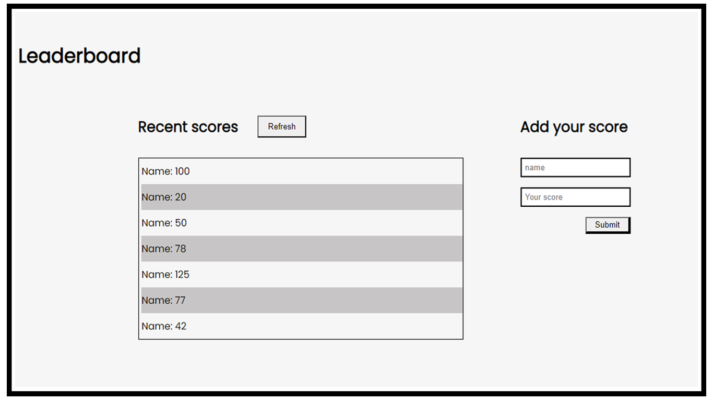

# Lader-board

> The leaderboard website displays scores submitted by different players. It also allows you to submit your score.


### ScreenShoot



## Built With

- HTML
- CSS 
- JavaScript Classes
- Linters
- Vscode
- Webpack-5

## Live Demo

[Live Demo](https://debas-31.github.io/leaderboard/dist/)

## Getting Started

To get a local copy up and running follow these simple example steps.

### Prerequisites

- Node and NPM
- Web browser (Google chrome)
- Code Editor (VSCode)

### Development (Running locally)

- git clone the project

```bash 
git clone git@github.com:Debas-31/leaderboard
```

- Install Dependencies

```bash
npm install
```

To run StyleLint by itself, you may run the lint task:

```bash
npx stylelint "**/*.{css,scss}"
```

Or to automatically fix issues found (where possible):

```bash
npx stylelint "**/*.{css,scss}" --fix
```

You can also check against Webhint:

```bash
npx hint --telemetry=off .
```

👤 **Debas Gebreslasie**

- [GitHub](https://github.com/Debas-31)
- [Twitter](https://twitter.com/DEBSH76956492)
- [LinkedIn](https://www.linkedin.com/in/debas-gebrengus)

## 🤝 Contributing

Contributions, issues and feature requests are welcome!

Feel free to check the [issues page](https://github.com/Debas-31/leaderboard/issues).

## Show your support

Give a ⭐️ if you like this project!

## Acknowledgments

- minimalist website
- web.archive.org
- Hat tip to anyone whose code was used
- Inspiration, resources/assets used
- etc

## 📝 License

[MIT licensed](https://github.com/Debas-31/leaderboard/blob/milestone-1-basic-page-structure/MIT.md).